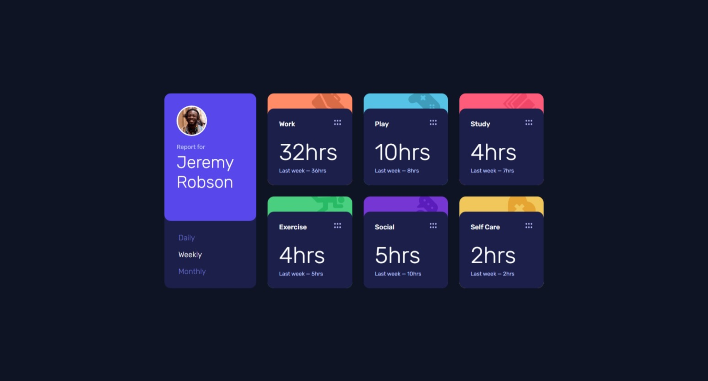
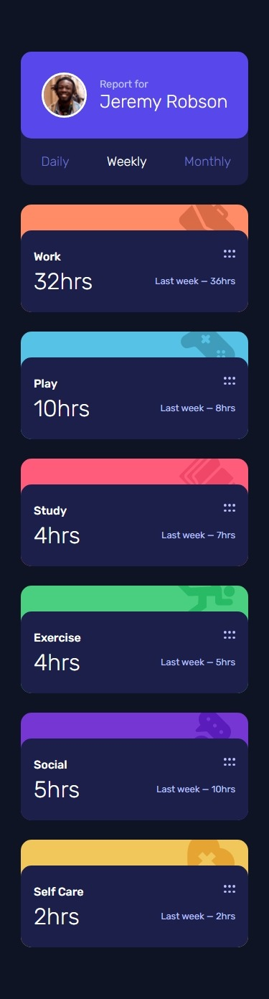

# Time Tracking Dashboard | Frontend Mentor

Welcome! This is a solution to the [Time Tracking Dashboard coding challenge on Frontend Mentor](https://www.frontendmentor.io/challenges/time-tracking-dashboard-UIQ7167Jw), built with Svelte and Typescript, bundled with Vite.

View the app live **[here](https://alimansoor-create.github.io/time-tracking-dashboard/)**

## Screenshots

## Features

- Allows switching between 3 different timeframes
- Retains the last selected timeframe
- Dashboard cards can be dragged and repositioned
- Neat load animation, thanks to svelte/transition

## Built with

- Svelte
- Vite
- Typescript
- Sass
- Jest (to test utility functions)
- SortableJS (to add the ability to drag cards)

## Comments

This was a relatively easy challenge, and I did not face any problems apart from a little struggle in making the styles responsive. A quick refresher on CSS Grid and Flexbox layouts. Had fun.

Please do leave your reviews [here](https://www.frontendmentor.io/solutions/time-tracking-dashboard-svelte-ts-sass-LSq9Sh9D54)!
